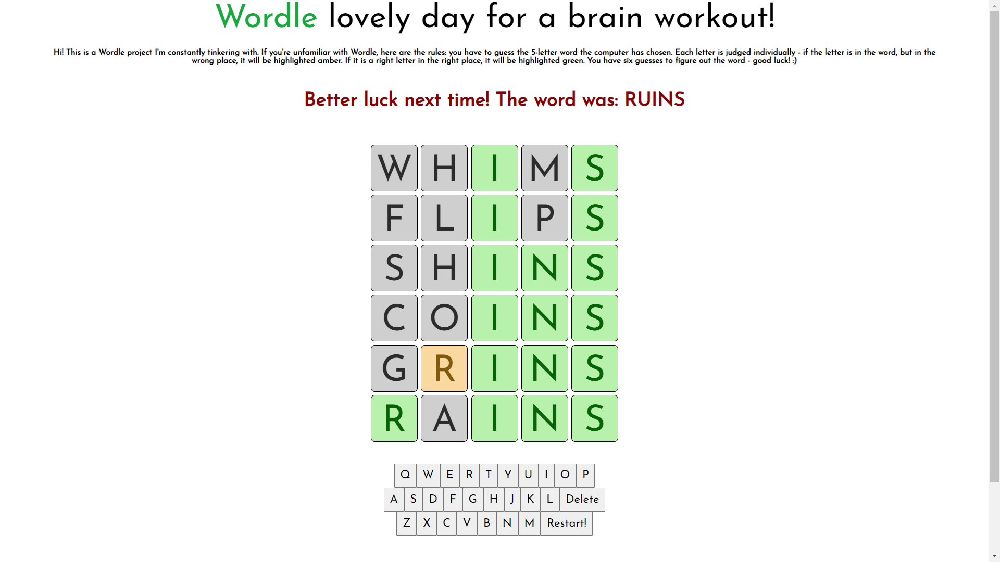
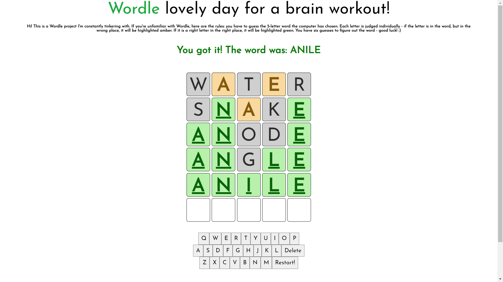
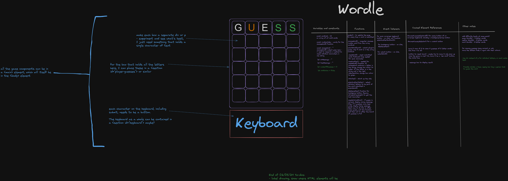
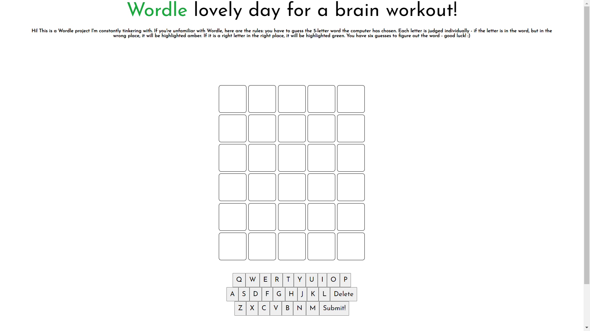

# Tawheed's Wordle - deployed link [here](https://tawheedahmed28.github.io/wordle-game-project/)

#### Solo project - a browser-based game of my choosing, with logic implemented in JavaScript, made within a week. I decided on Wordle, as I was very familiar with the game.

### Technologies used

Front end:
- HTML
- CSS
- JavaScript




---

### Brief

- Render your game in a browser using DOM manipulation.
- The game must include win/loss criteria, with appropriate logic and messages rendered in HTML.
- Include a HTML, CSS and JavaScript file organised appropriately.
- Deploy the game online for others to play.

---

### Game instructions

Wordle is a common word game (and my favourite 5 minute game!) where the aim is to correctly guess a 5 letter word randomly selected by the computer. You have 6 attempts to do so. For each character in your guess, there is a check:

**If the character is present in the word and is in the right place, the character is highlighted green.**

**If the character is present in the word, but is in the wrong place, the character is highlighted amber.**

**If the character is not present at all, the character is left alone, or in my case, greyed out.**

You win once all 5 characters in your guess turn green i.e. when they are correct.

---

### Plan

For this project, I put together an Excalidraw board to visualise my final product, along with detailed notes of the logic I intend to add. My plan for this Wordle project can be seen below:



---

### Build process

I first began with designing the gameplay grid, as I felt it would make coding the logic easier if I visualised it. Writing out a `console.log` for each step was also a solution, and maybe an easier one, but at the time, I just felt like doing some design!

Making this involved lots of `querySelector` elements and Flexbox CSS.



Console logs were, of course, still very helpful in other areas - which brings me to starting the logic. 

---

Firstly, I needed an array of words. I wanted a as large an array as possible, so as not to make the game boring. Though the aim of this project is to strengthen my JavaScript skills, it's important to still have fun with it!

I found [this file](https://www-cs-faculty.stanford.edu/~knuth/sgb-words.txt), and used these words. I then needed to convert all these words to uppercase to make them consistent with my on screen keyboard characters.

```js
const lowercaseWordList = ["about", "which", ...]
const wordList = lowercaseWordList.map((word) => {
    return word.toUpperCase()
})
```

Now that all words were in uppercase, I could focus on how the game would start.

I began with a function `chooseWord()` that generated a random number for the index of the chosen word.

```js
let chosenWord = ""
const chooseWord = () => {
    const randomIndex = Math.floor(Math.random() * wordList.length)
    chosenWord = wordList[randomIndex]
}
```

For the first bit of logic from a player's perspective, I added the following code to allow the player to type and delete characters, as well as see the output:

```js
const renderLetter = () => {
    for (let i = 0; i < 5; i++) {
        if (playedWord[i]) {
        currentGuess[i].innerText = playedWord[i]
        } else {
            playedWord[i] = ""
        }
    }
} 

const selectLetter = (event) => {
    if (event.target.id === "backspace") {
        deleteLetter()
    } else if (event.target.id === "submit" && playedWord.length < 5) {
        return
    } else if (event.target.id === "submit" && playedWord.length === 5) {
        submitWord()
    } else if (playedWord.length === 5) {
        return
    } else {
        playedWord += event.target.id
        renderLetter()
    }
}

const deleteLetter = () => {
    playedWord = playedWord.slice(0, -1)
    currentGuess[playedWord.length].innerText = ""
    renderLetter()
}
```

Each row of squares represents a guess, an array of five single character strings. The next logic I added was to loop through this array and check the letters, by looping through *all* letters and checking *one* criteria - green to start, then moving on to amber, then grey. This order is required as it is in decreasing specificity.

I used the following logic:

---

**Green**: check if the letter being checked is the same as the letter in the generated word *at the same index* as the letter being checked.

**Amber**: check if the letter being checked is contained in the generated word at all, and not already given the "green" status, at *any index*.

**Grey**: apply this if the letter does not have "green" or "amber" status.

---

After this, I created a function to check win status, called after every guess. When the player has had six guesses, or whenever the word is guessed correctly, the game ends - whichever comes first.

```js
const checkWinCondition = () => {
    const winMessage = ("You got it! The word was: " + chosenWord)
    const loseMessage = ("Better luck next time! The word was: " + chosenWord)
    const hasGreenClass = (letter) => letter.classList.contains("green")
    const isTrue = (status) => status === true
    if (currentGuess.every(hasGreenClass)) {
        resultMessage.innerText = winMessage
        resultMessage.classList.add("result-win")
        for (const keyboardButton of keyboardButtons) {
            keyboardButton.removeEventListener("click", selectLetter)
        }
    } else if (guessSubmitStatus.every(isTrue) && !currentGuess.every(hasGreenClass)) {
        for (const keyboardButton of keyboardButtons) {
            keyboardButton.removeEventListener("click", selectLetter)
        }
        resultMessage.innerText = loseMessage
        resultMessage.classList.add("result-lose")
    } else {
        return
    }
    submitButton.removeEventListener("click", submitWordAccessibility)
    submitButton.innerText = "Restart!"
    submitButton.addEventListener("click", initialise)
}
```

The submit button then functions as a restart button, allowing the user to reset the board and go again.

---

### Challenges

As I briefly mentioned earlier, checking the submitted guess proved tricky, as I had to check for three conditions of varying specificity. It was particularly challenging when the player's guess would contain more of a certain character than is present in the word (e.g. if the word to guess is BUMPY and your guess is MUMMY). At first, all 3 Ms in the guess would be either amber or green. However, since the solution only contained 1 M, the only M in the guess that should be "correct" in some form is the 2nd M, and it would be green (right character, right place). I sorted this problem by creating an object where each character in the solution was tallied, and then, for each character in the guess, checked if it should be green, then if amber. If either one returned true, I'd take one off of that character's tally in the object.

```js
const checkLetter = (word) => {
    for (let i = 0; i < chosenWord.length; i++) {
        if (solutionWordCharacters[chosenWord[i]]) {
            solutionWordCharacters[chosenWord[i]]++
        } else {
            solutionWordCharacters[chosenWord[i]] = 1
        }
    }
    for (let i = 0; i < 5; i++) {
        if (word[i] === chosenWord[i]) {
           currentGuess[i].classList.add("green")
           solutionWordCharacters[word[i]]--
        }}
    for (let i = 0; i < 5; i++) {
        if (solutionWordCharacters[word[i]] > 0) {
            currentGuess[i].classList.add("amber")
            solutionWordCharacters[word[i]]--
        } else if (!currentGuess[i].classList.contains("green") && !currentGuess[i].classList.contains("amber")) {
            currentGuess[i].classList.add("grey")
        }
    }
    solutionWordCharacters = {}
}
```

I also, somewhat unintentionally, set another challenge upon myself - though I wasn't required to do so, I ended up implementing a restart function into my game without having to reload the page. I was proud of myself for pulling this off as it not only means a smoother restart, but it also makes it easier to potentially add game data in the future, like the user's gameplay statistics.

```js
const initialise = () => {
    chooseWord()
    solutionWordCharacters = {}
    playedWord = ""
    currentGuess = playerGuesses[0]
    playerGuesses.forEach((guess) => {
        guess.forEach((letter) => {
            letter.innerText = ""
            if (letter.classList.contains("grey")) {
                letter.classList.remove("grey")
            }
            if (letter.classList.contains("green")) {
                letter.classList.remove("green")
            }
            if (letter.classList.contains("amber")) {
                letter.classList.remove("amber")
            }
            letter.classList.remove("accessibility-green") 
            letter.classList.remove("accessibility-amber")
        })
    })
    submitButton.removeEventListener("click", initialise)
    submitButton.innerText = "Submit!"
    guessSubmitStatus.forEach((status, i) => {
        guessSubmitStatus[i] = false
    })
    if (resultMessage.classList.contains("result-lose")) {
        resultMessage.classList.remove("result-lose")
    }
    if (resultMessage.classList.contains("result-win")) {
        resultMessage.classList.remove("result-win")
    }
    for (const keyboardButton of keyboardButtons) {
        keyboardButton.addEventListener("click", selectLetter) 
    }
    accessibilityButton.removeEventListener("click", initialise)
    accessibilityButton.addEventListener("click", initialiseAccessibility)
    submitButton.removeEventListener("click", submitWordAccessibility)
    submitButton.addEventListener("click", selectLetter)
}
const initialiseAccessibility = () => {
    initialise()
    accessibilityButton.removeEventListener("click", initialiseAccessibility)
    accessibilityButton.addEventListener("click", initialise)
    submitButton.removeEventListener("click", selectLetter)
    submitButton.addEventListener("click", submitWordAccessibility)
    submitButton.removeEventListener("click", initialiseAccessibility)
}
```
---

### Wins

**Styling** - I wanted to go for a simple and effective style and I feel as though I nailed that - nice grid and colours transitioning in, and a keyboard with dynamic text, just to name a few things!

**Win condition logic** - this was probably the task that took the longest, and also where I got stuck the most. So many different things I tried were very nearly right, but not quite, so when this clicked and I finally got it, it was really satisfying.

---
### Key learnings

I feel as though this project really helped me to get a grasp on JavaScript logic and improve my problem solving skills, as the win condition check required many steps. In turn, since the logic had to be applied to DOM elements, I also greatly improved my DOM manipulation skills throughout this project.

---

### Bugs

In terms of logic and functionality, I have not found anything, however I am aware that the CSS needs some work:

- On desktop, you have to zoom out on your webpage to get a good view of the game board 

- Sometimes buttons can overlap depending on screen size

---

### Future improvements

- Add different difficulties:

    - **Nurdle**: For a pellet-sized challenge. 4 letter words.

    - **Wordle**: For the purists. 5 letter words.

    - **Hurdle**: For those looking to take a leap. 6 letter words.

- More accessibility:

    - Clearer colour scheme
    - Dark mode

- Mobile compatibility

## Enjoy the game! <3